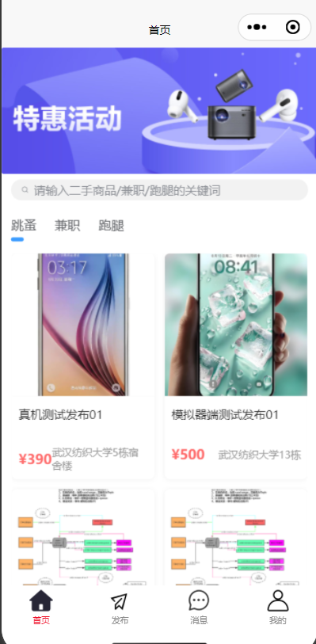

  

<h3 align="center"><b>校园惠</b> <em>(CJ-Transaction-Weapp)</em></h3>

基于unicloud云开发的校园二手商品，兼职，跑腿的微信小程序

 
## 概述

- 本人经过市场调研，独立开发，自己摸索，找到的合适技术用于开发；

- 前端：vue,uniapp,uviewui  

- 后端：unicloud云开发(编写JavaScript云函数)

- 协作开发：项目主分支为mian, 开发分支为dev, 如有新开发者可以从dev切出分支进行协作开发

- 提供灵活的微信小程序分包策略，按照不同的功能模块进行代码解耦分离；

- 工程化开发，提供网络请求、缓存、全局状态管理等工具函数；

<table>
	<tr>
		<td></td>
		<td></td>
		<td></td>
		<td></td>
	</tr>
	<tr>
		<td></td>
		<td></td>
		<td></td>
		<td></td>
	</tr>

</table>

## 微信小程序体验版(扫描二维码)
